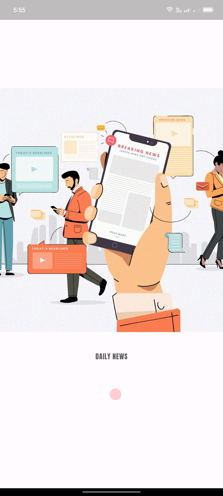
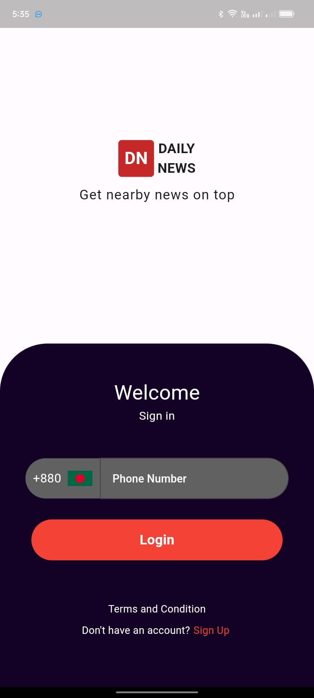
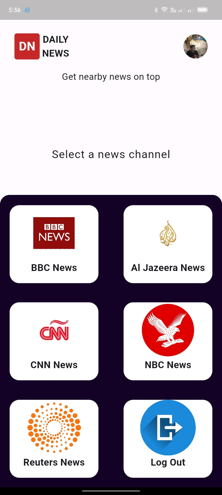
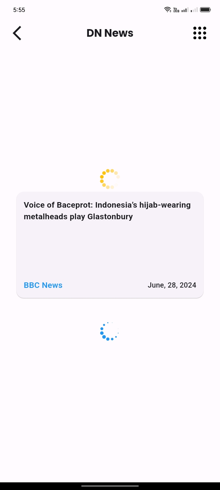
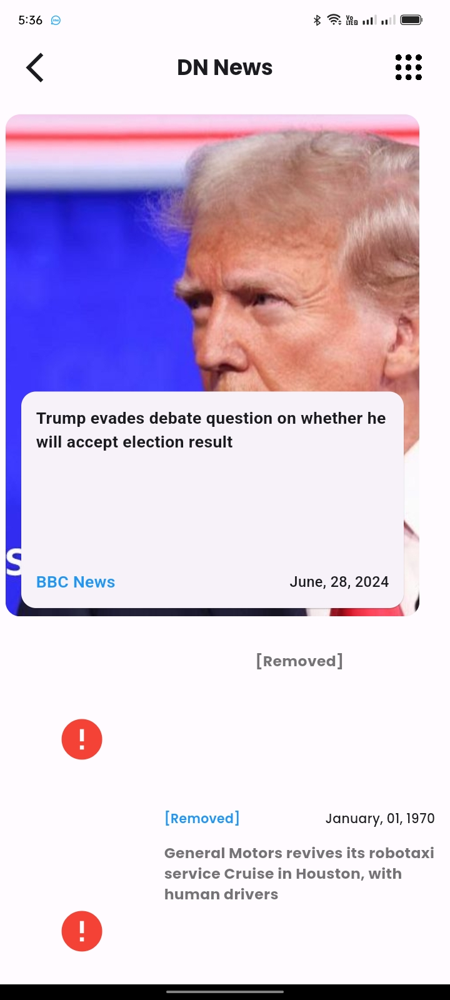
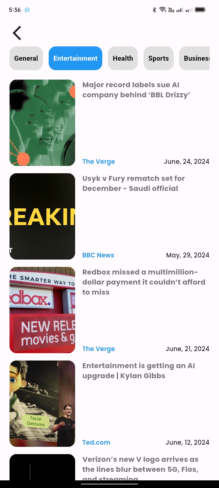

# News Apps Based on API

## This are the all screen of this app

<h3>Splash Screen</h3>

<h3>Login Screen</h3>

<h3>Home Screen</h3>

<h3>Loading</h3>

<h3>News Screen</h3>

<h3>Content Screen</h3>

<h3>Detail Screen</h3>
